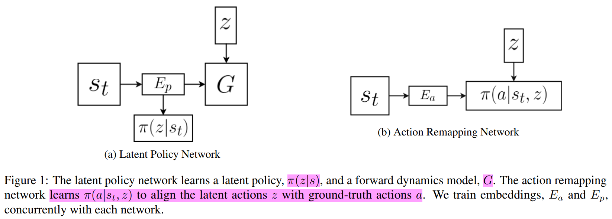
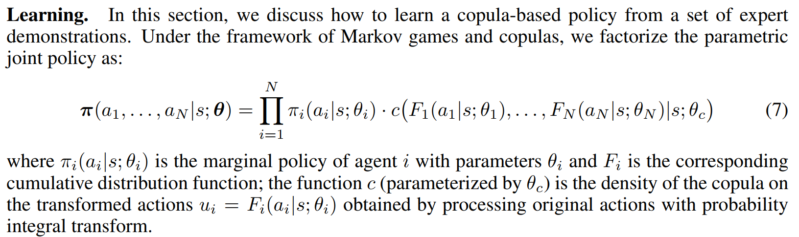

# Papers
Papers related to machine learning, deep learning and reinforcement learning

## Contents
* [Reinforcement Learning](#reinforcement-Learning)
  * [Survey](#survey)
  * [Value-based](#value-based)
  * [Policy-based](#policy-based)
  * [Model Based](#model-based)
  * [Offline RL](#offline-rl)
  * [Imitation Learning](#imitation-learning)
  * [Inverse Reinforcement Learning](#inverse-reinforcement-learning)
  * [Transfer Learning](#transfer-learning)
  * [Applications](#applications)
    * [Intelligent Transportation Systems](#intelligent-transportation-systems)
    * [Gaming](#gaming)

  
* [Multi Agent Reinforcement Learning](#multi-agent-reinforcement-learning)
  * [Survey](#survey)
  * [Value-based MARL](#value-based-marl)
  * [Policy-based MARL](#policy-based-marl)
  * [Parameter Sharing](#parameter-sharing)
  * [Graph Convolutional Reinforcement Learning](#graph-convolutional-reinforcement-learning)
  * [Offline MARL](#offline-marl)
  * [Multi-agent Imitation Learning](#multi-agent-imitation-learning)
  * [Traffic Applications](#traffic-applications)
    * [Autonomous Driving](#autonomous-driving)
    * [Traffic Signal Control](#traffic-signal-control)
      

* [Meta Learning](#meta-Learning)
  * [Meta Learning](#meta-learning)
  * [Meta MARL](#meta-marl)
  * [Offline Meta](#offline-meta)
  * [Traffic Applications](traffic-applications)
  

# Reinforcement Learning

## Survey

## Value-based

- **DRQN: Hausknecht, Matthew, and Peter Stone. "Deep recurrent q-learning for partially observable mdps." arXiv preprint arXiv:1507.06527 (2015).**
> To explore well in the particial observed environment, this article investigates the effects of adding recurrency to a Deep Q-Network (DQN) by replacing the first post-convolutional fully-connected layer with a recurrent LSTM. 

## Policy-based

## Offline RL
- Survey: Levine, Sergey, et al. **"Offline reinforcement learning: Tutorial, review, and perspectives on open problems."** arXiv preprint arXiv:2005.01643 (2020).

- (BCQ): Fujimoto, Scott, David Meger, and Doina Precup. **"Off-policy deep reinforcement learning without exploration."** International Conference on Machine Learning. PMLR, 2019.

- (BEAR) Kumar, Aviral, et al. **"Stabilizing off-policy q-learning via bootstrapping error reduction."** arXiv preprint arXiv:1906.00949 (2019).

- Chen, Lili, et al. **"Decision transformer: Reinforcement learning via sequence modeling."** arXiv preprint arXiv:2106.01345 (2021).
> Transformer-based RL framework for offline RL.

- Janner, Michael, Qiyang Li, and Sergey Levine. **"Reinforcement Learning as One Big Sequence Modeling Problem."** arXiv preprint arXiv:2106.02039 (2021).
> Represent the RL decision marking problem as a Trajectory Transformer.

- Fujimoto, Scott, and Shixiang Shane Gu. **"A Minimalist Approach to Offline Reinforcement Learning."** arXiv preprint arXiv:2106.06860 (2021).

- Mandlekar, Ajay, et al. **"Iris: Implicit reinforcement without interaction at scale for learning control from offline robot manipulation data."**
  2020 IEEE International Conference on Robotics and Automation (ICRA). IEEE, 2020
> IRIS factorizes the control problem into a goal-conditioned low-level controller  that imitates short demonstration sequences and a high-level
goal selection mechanism that sets goals for the low-level and selectively combines parts of suboptimal solutions leading to
more successful task completions. A *conditional Variational Autoencoder (cVAE)* is used to encode the goal states.

**Offline-to-Online**
- Nair, Ashvin, et al. **"AWAC: Accelerating Online Reinforcement Learning with Offline Datasets."** (2020).
> AWAC is that enforcing a policy update constraint implicitly on actor-critic methods results in a
stable learning algorithm amenable for off-policy learning

- Lee, Seunghyun, et al. **"Offline-to-Online Reinforcement Learning via Balanced Replay and Pessimistic Q-Ensemble."** arXiv preprint arXiv:2107.00591 (2021).
> propose a balanced replay scheme that prioritizes samples encountered online while also encouraging the use of near-on-policy
samples from the offline dataset. Furthermore, we leverage multiple Q-functions
trained pessimistically offline, thereby preventing overoptimism concerning unfamiliar actions at novel states during the initial training phase.

## Model Based
- Kurutach, Thanard, et al. **"Model-ensemble trust-region policy optimization."** arXiv preprint arXiv:1802.10592 (2018).
> use an ensemble of models to maintain the model uncertainty and regularize the learning process.

- Matsushima, Tatsuya, et al. **"Deployment-efficient reinforcement learning via model-based offline optimization."** arXiv preprint arXiv:2006.03647 (2020).
> Deployment Efficiency: counts the number of changes in the data-collection policy during learning
> learns an ensemble of dynamics models in conjunction with a policy using imaginary rollouts while implicitly regularizing the learned policy
via appropriate parameter initialization and conservative trust-region learning updates.

- Zhang, Marvin, et al. **"Solar: Deep structured representations for model-based reinforcement learning."** International Conference on Machine Learning. PMLR, 2019.

**Uncertainty Estimate**
- Yu, Tianhe, et al. **"Mopo: Model-based offline policy optimization."** arXiv preprint arXiv:2005.13239 (2020).
> develop a practical method that estimates model error using the predicted variance  of a learned model, uses this uncertainty estimate as a reward penalty, and trains a policy using
MBPO in this uncertainty-penalized MDP.

- (LOMPO) Rafailov, Rafael, et al. **"Offline reinforcement learning from images with latent space models."** Learning for Dynamics and Control. PMLR, 2021.
>  (i) Using the available offline data, we learn a variational model with an image encoder, an image decoder, and an ensemble of latent dynamics
models. 
> (ii) We construct an uncertainty penalized MDP in the latent state space (which induces a
corresponding uncertainty-penalized POMDP in observation space), where we quantify uncertainty
based on disagreement between forward models in the latent state space. 
> (iii) We learn a control policy in the learned latent space using the offline dataset by optimizing an uncertainty-penalized  objective. 

## Imitation Learning
- Lynch, Corey, et al. **"Learning latent plans from play."** Conference on Robot Learning. PMLR, 2020.
> Play-LMP, a self-supervised method that learns to organize play behaviors in a latent space, then  reuse them at test time to achieve specific goals. 
Play-LMP consists of three components trained end-to-end: 1) Plan recognition: a
stochastic sequence encoder, taking a randomly sampled play sequence τ as input and mapping it
to a distribution q_φ(z|τ) in latent plan space, the learned variational posterior. 2) Plan proposal: a
stochastic encoder taking the initial state s_c and final state s_g from the same sequence τ, outputting
p_θ(z| s_c; s_g), the learned conditional prior. The goal of this encoder is to represent the full distribution over all high-level behaviors that might connect current and goal state, potentially capturing
multiple solutions. 3) Plan and goal-conditioned policy: A policy conditioned on the current state
s_c, goal state s_g and latent plan z sampled from the posterior q_φ(z|τ), trained to reconstruct the
goal-directed actions taken during play, following inferred plan z.

- (BCO) Torabi, Faraz, Garrett Warnell, and Peter Stone. **"Behavioral cloning from observation."** arXiv preprint arXiv:1805.01954 (2018).
> The agent is initialized with a (random) policy which interacts with the environment and collects data to to
learn its own agent-specific inverse dynamics model. Then, given
**state-only** demonstration information, the agent uses this learned model to infer the expert’s missing action information. Once these
actions have been inferred, the agent performs imitation learning.

- (ILPO) Edwards, Ashley, et al. **"Imitating latent policies from observation."** International Conference on Machine Learning. PMLR, 2019.
> 

## Hierarchical Reinforcement Learning
- Nachum, Ofir, et al. **"Data-efficient hierarchical reinforcement learning."** arXiv preprint arXiv:1805.08296 (2018).

## Inverse Reinforcement Learning
- (FORM) Jaegle, Andrew, et al. **"Imitation by Predicting Observations."** International Conference on Machine Learning. PMLR, 2021.
>  an inverse RL objective and imitates using a model of expert behavior learned by generative modelling of the expert’s observations, without needing ground truth actions. 

## Transfer Learning
- Cang, Catherine, et al. **"Behavioral Priors and Dynamics Models: Improving Performance and Domain Transfer in Offline RL."** arXiv preprint arXiv:2106.09119 (2021).

## Applications

### Intelligent Transportation Systems
- **Mavrogiannis, Angelos, Rohan Chandra, and Dinesh Manocha. "B-GAP: Behavior-Guided Action Prediction for Autonomous Navigation." arXiv preprint arXiv:2011.03748 (2020).**
> We use a reinforcement learning-based navigation scheme that uses a proximity graph (graph convolutional network (GCN) of traffic agents and computes a safe trajectory for the ego-vehicle that accounts for aggressive driver maneuvers such as overtaking, over-speeding, weaving, and sudden lane changes. 

### Gaming
- Zha, Daochen, et al. **"DouZero: Mastering DouDizhu with Self-Play Deep Reinforcement Learning."** arXiv preprint arXiv:2106.06135 (2021).
> DouZero enhances traditional Monte-Carlo methods with deep neural networks, action encoding, and parallel actors.

# Multi Agent Reinforcement Learning

## Survey MARL
- Da Silva, Felipe Leno, and Anna Helena Reali Costa. **"A survey on transfer learning for multiagent reinforcement learning systems."** Journal of Artificial Intelligence Research 64 (2019): 645-703.
> Intra-Agent Transfer - Reuse of knowledge generated by the agent in new tasks or domains.
> Inter-Agent Transfer: best reuse knowledge received from communication with another agent, which has different sensors and (possibly) internal
representations. 

- Wong, Annie, et al. **"Multiagent Deep Reinforcement Learning: Challenges and Directions Towards Human-Like Approaches."** arXiv preprint arXiv:2106.15691 (2021).
> focusing on categories: centralised training and decentralised execution, opponent modelling, communication, efficient coordination, and reward shaping.

## Value-based MARL
- **VDN (2017): Sunehag, Peter, et al. "Value-decomposition networks for cooperative multi-agent learning." arXiv preprint arXiv:1706.05296 (2017).**
> novel learned additive value-decomposition approach over individual agents. Implicitly, the value decomposition network aims to learn an optimal linear value decomposition from the team reward signal, by back-propagating the total Q gradient through deep neural networks representing the individual component value functions. 

- **QMIX (2018): Rashid, Tabish, et al. "QMIX: Monotonic value function factorisation for deep multi-agent reinforcement learning." arXiv preprint arXiv:1803.11485 (2018).**
> QMIX is a novel value-based method that can train decentralised policies in a centralised end-to-end fashion. QMIX employs a network that estimates joint
action-values as a complex non-linear combination of per-agent values that condition only on local observations.

- **DIAL (2016): Foerster, Jakob, et al. "Learning to communicate with deep multi-agent reinforcement learning." Advances in neural information processing systems. 2016.**
> DQN, parameter sharing: the message is generated together with action-value estimation by each DQN agent, then it is encoded and summed with other input signals at the receiver side. Dial pushes gradients from one agent to another through the communication channel.

- **CommNet (2016): Sukhbaatar, Sainbayar, and Rob Fergus. "Learning multiagent communication with backpropagation." Advances in neural information processing systems. 2016.**
> They propose a model where cooperating agents learn to communicate amongst themselves before taking actions. Each agent is controlled by a deep feed-forward network, which additionally has access to a communication channel carrying a continuous vector. Through this channel, they receive the summed transmissions of other agents.

- IAC (2021): Ma, Xiaoteng, et al. "Modeling the Interaction between Agents in Cooperative Multi-Agent Reinforcement Learning." arXiv preprint arXiv:2102.06042 (2021).
> we propose a novel cooperative MARL algorithm named as interactive actor-critic (IAC), which models the interaction of agents from
the perspectives of policy and value function. On the policy side, a multi-agent joint stochastic policy is introduced by adopting a
collaborative exploration module, which is trained by maximizing the entropy-regularized expected return. On the value side, we
use the shared attention mechanism to estimate the value function of each agent, which takes the impact of the teammates into
consideration.  

## Policy-based MARL

- **ConsensusNet (2018): Zhang, Kaiqing, et al. "Fully decentralized multi-agent reinforcement learning with networked agents." arXiv preprint arXiv:1802.08757 (2018).**
> Actor-Critic: the actor step is performed individually by each agent without the need to infer the policies of others. For the critic step, each agent shares its estimate of the value function with its neighbors on the network, so that a consensual estimate is achieved, which is further used in the subsequent actor step.

- **MAAC: Iqbal, Shariq, and Fei Sha. "Actor-attention-critic for multi-agent reinforcement learning." International Conference on Machine Learning. PMLR, 2019.**
> We present an actor-critic algorithm that trains decentralized policies in multiagent settings, using centrally computed critics that share an attention mechanism which selects relevant information for each agent at every timestep. Our attention critic is able to dynamically select which agents to attend to at each time point during training, improving performance in multi-agent domains with complex interactions.

- **NeurComm: Chu, Tianshu, Sandeep Chinchali, and Sachin Katti. "Multi-agent Reinforcement Learning for Networked System Control." arXiv preprint arXiv:2004.01339 (2020).**
> Actor-Critic: introduce a spatial discount factor to stabilize training, especially for non-communicative algorithms. We propose a new neural defferentiable communication protocol to adaptively share information on both system states and agent behaviors. 

## Parameter Sharing

- Gupta, Jayesh K., Maxim Egorov, and Mykel Kochenderfer. **"Cooperative multi-agent control using deep reinforcement learning." International Conference on Autonomous Agents and Multiagent Systems**. Springer, Cham, 2017.

- Lin, Kaixiang, et al. **"Efficient large-scale fleet management via multi-agent deep reinforcement learning."** Proceedings of the 24th ACM SIGKDD International Conference on Knowledge Discovery & Data Mining. 2018.

## Graph Convolutional Reinforcement Learning

- Jiang, Jiechuan, et al. **"Graph convolutional reinforcement learning."** arXiv preprint arXiv:1810.09202 (2018).

- Dong, Jiqian, et al. **"A DRL-based Multiagent Cooperative Control Framework for CAV Networks: a Graphic Convolution Q Network."** arXiv preprint arXiv:2010.05437 (2020).

## Offline MARL
- ICQ: Yang, Yiqin, et al. **"Believe What You See: Implicit Constraint Approach for Offline Multi-Agent Reinforcement Learning."** arXiv preprint arXiv:2106.03400 (2021).

## Multi-agent Imitation Learning
- Wang, Hongwei, et al. "Multi-Agent Imitation Learning with Copulas." arXiv preprint arXiv:2107.04750 (2021).
> we propose to use copula, a powerful statistical tool for capturing dependence among random variables, to explicitly model the correlation and coordination in multi-agent systems. 

## Traffic Applications

### Autonomous Driving
- self-play: Tang, Yichuan. **"Towards learning multi-agent negotiations via self-play."** Proceedings of the IEEE/CVF International Conference on Computer Vision Workshops. 2019.

### Traffic Signal Control

# Meta Learning

## Meta Learning
- (MAML): Finn, Chelsea, Pieter Abbeel, and Sergey Levine. **"Model-agnostic meta-learning for fast adaptation of deep networks."** International Conference on Machine Learning. PMLR, 2017.
- (Reptile): Nichol, Alex, Joshua Achiam, and John Schulman. **"On first-order meta-learning algorithms."** arXiv preprint arXiv:1803.02999 (2018).
- PEARL: Rakelly, Kate, et al. **"Efficient off-policy meta-reinforcement learning via probabilistic context variables." International conference on machine learning.** PMLR, 2019.
- MAML++: Antoniou, Antreas, Harrison Edwards, and Amos Storkey. **"How to train your MAML."** arXiv preprint arXiv:1810.09502 (2018).

- MQL: Fakoor, Rasool, et al. **"Meta-q-learning."** arXiv preprint arXiv:1910.00125 (2019).
> First, we show that Q-learning is competitive with state-of-the-art meta-RL algorithms if given access to a context variable that is a representation of the past
trajectory. Second, a multi-task objective to maximize the average reward across the training tasks is an effective method to meta-train RL policies. Third, past data
from the meta-training replay buffer can be recycled to adapt the policy on a new task using off-policy updates.  

- 

## Meta MARL
- Parisotto, Emilio, et al. **"Concurrent meta reinforcement learning."** arXiv preprint arXiv:1903.02710 (2019).
- Chen, Long, et al. **"Multiagent Meta-Reinforcement Learning for Adaptive Multipath Routing Optimization."** IEEE Transactions on Neural Networks and Learning Systems (2021).
- Munir, Md Shirajum, et al. **"Multi-Agent Meta-Reinforcement Learning for Self-Powered and Sustainable Edge Computing Systems."** IEEE Transactions on Network and Service Management (2021).
- Gupta, Abhinav, Angeliki Lazaridou, and Marc Lanctot. **"Meta Learning for Multi-agent Communication."** Learning to Learn-Workshop at ICLR 2021. 2021.

## Offline Meta
- Mitchell, Eric, et al. **"Offline Meta-Reinforcement Learning with Advantage Weighting."** arXiv preprint arXiv:2008.06043 (2020).
- Li, Lanqing, Rui Yang, and Dijun Luo. **"FOCAL: Efficient Fully-Offline Meta-Reinforcement Learning via Distance Metric Learning and Behavior Regularization."** arXiv preprint arXiv:2010.01112 (2020).

## Imitation Learning
- Duan, Yan, et al. **"One-shot imitation learning."** arXiv preprint arXiv:1703.07326 (2017).
- James, Stephen, Michael Bloesch, and Andrew J. Davison. **"Task-embedded control networks for few-shot imitation learning."** Conference on Robot Learning. PMLR, 2018.

## Traffic Applications
- Jaafra, Yesmina, et al. **"Meta-Reinforcement Learning for Adaptive Autonomous Driving."** (2019)
-   
- Ye, Fei, et al. **"Meta Reinforcement Learning-Based Lane Change Strategy for Autonomous Vehicles."** arXiv preprint arXiv:2008.12451 (2020).  
- Hu, Ye, et al. **"Distributed multi-agent meta learning for trajectory design in wireless drone networks."** IEEE Journal on Selected Areas in Communications (2021).

